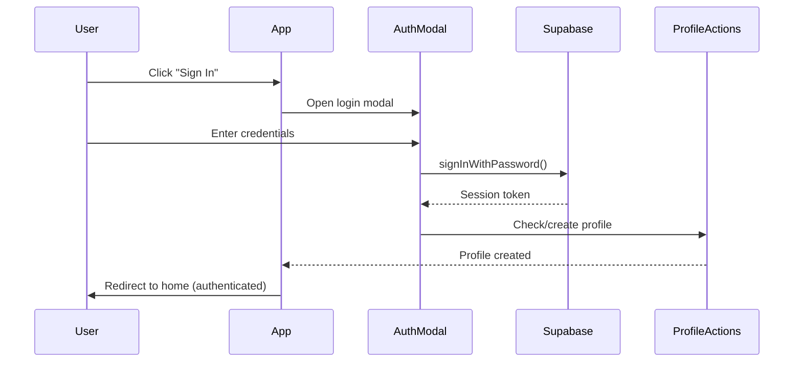

# VNTV Authentication & User Management

**Status:** ✅ Complete (Milestone 3)  
**Last Updated:** August 26, 2026

## Overview

VNTV implements a comprehensive authentication and user management system using Supabase Auth. The system includes email/password authentication, Google OAuth, user profiles, role-based access control, and content gating.

---

## Table of Contents

1. [Authentication Methods](#authentication-methods)
2. [User Profile System](#user-profile-system)
3. [Role Management](#role-management)
4. [Content Access Gates](#content-access-gates)
5. [API Reference](#api-reference)
6. [Testing Guide](#testing-guide)
7. [Security Considerations](#security-considerations)

---

## Authentication Methods

### Supported Methods

- ✅ **Email/Password** - Traditional authentication
- ✅ **Google OAuth** - One-click social login
- 🔜 **Facebook OAuth** - Prepared for future implementation

### Authentication Flow



### Implementation

#### Client-Side Usage

```tsx
import { useAuth } from "@/components/auth";

function MyComponent() {
  const { openLogin, openSignup } = useAuth();
  
  return (
    <>
      <Button onClick={openLogin}>Sign In</Button>
      <Button onClick={openSignup}>Sign Up</Button>
    </>
  );
}
```

#### Server-Side Actions

```typescript
import { signIn, signOut } from "@/app/auth/actions";

// Sign in
await signIn(formData);

// Sign out
await signOut();

// OAuth
await signInWithOAuth("google");
```

---

## User Profile System

### Profile Schema

```typescript
interface Profile {
  id: string;                    // User ID (from Supabase Auth)
  email: string;                 // User email
  full_name: string | null;      // Display name
  avatar_url: string | null;     // Profile picture URL
  theme: "light" | "dark" | "system" | null;
  newsletter_subscribed: boolean;
  created_at: string;
  updated_at: string;
}
```

### Features

- **Auto-creation**: Profiles are automatically created on first login/signup
- **Avatar upload**: Max 2MB, supports JPG/PNG/GIF
- **Theme preference**: Synced with system theme provider
- **Settings page**: Located at `/settings`

### Usage

```tsx
import { useProfile } from "@/hooks/use-profile";

function ProfileComponent() {
  const { profile, loading, error } = useProfile();
  
  if (loading) return <Spinner />;
  if (error) return <Error message={error} />;
  
  return <div>Welcome, {profile.full_name}!</div>;
}
```

### Profile Actions

```typescript
import { updateProfile, uploadAvatar, deleteAvatar } from "@/app/profile/actions";

// Update profile
await updateProfile({
  full_name: "John Doe",
  theme: "dark",
  newsletter_subscribed: true,
});

// Upload avatar
const formData = new FormData();
formData.append("avatar", file);
await uploadAvatar(formData);

// Delete avatar
await deleteAvatar();
```

---

## Role Management

### Role System

VNTV uses a flexible role-based access control (RBAC) system:

```
┌─────────────┐
│   User      │
└──────┬──────┘
       │
       │ has many
       ▼
┌─────────────┐
│ User Roles  │
└──────┬──────┘
       │
       │ references
       ▼
┌─────────────┐
│   Roles     │
└─────────────┘
```

### Default Roles

- **admin** - Full system access, user management
- **editor** - Content creation and editing
- **author** - Content creation only
- **subscriber** - Basic authenticated user

### Admin Pages

- `/admin/roles` - Manage roles (create, edit, delete)
- `/admin/users` - Manage users and assign roles

### Usage

#### Check User Role (Server)

```typescript
import { hasRole, isAdmin } from "@/app/admin/roles/actions";

// Check specific role
const hasEditorRole = await hasRole("editor");

// Check admin
const userIsAdmin = await isAdmin();
```

#### Protect Routes (Client)

```tsx
import { AdminRoute } from "@/components/auth";

function AdminPage() {
  return (
    <AdminRoute>
      <AdminContent />
    </AdminRoute>
  );
}
```

#### Protect Routes (Server)

```tsx
import { isAdmin } from "@/app/admin/roles/actions";
import { redirect } from "next/navigation";

export default async function AdminPage() {
  const userIsAdmin = await isAdmin();
  
  if (!userIsAdmin) {
    redirect("/");
  }
  
  return <AdminContent />;
}
```

### Role Management API

```typescript
import {
  getRoles,
  createRole,
  updateRole,
  deleteRole,
  assignRole,
  removeRole,
} from "@/app/admin/roles/actions";

// Get all roles
const { data: roles } = await getRoles();

// Create role
const formData = new FormData();
formData.append("name", "moderator");
formData.append("description", "Can moderate comments");
await createRole(formData);

// Assign role to user
await assignRole(userId, roleId);

// Remove role from user
await removeRole(userRoleId);
```

---

## Content Access Gates

### Overview

Content gates prompt anonymous users to authenticate after consuming a portion of content. This increases user registration while providing a taste of the content.

### Gate Types

#### Article Gate

Triggers after user scrolls past a threshold (typically 50% of article).

```tsx
import { ContentAccessGate, useArticleGate } from "@/components/content";

function ArticlePage() {
  const { shouldShowGate, triggerGate } = useArticleGate();
  
  useEffect(() => {
    if (scrollProgress > 0.5) {
      triggerGate();
    }
  }, [scrollProgress]);
  
  return (
    <>
      <article>...</article>
      <ContentAccessGate
        variant="article"
        isActive={shouldShowGate}
        onAuthenticated={() => {
          // Resume reading
        }}
      />
    </>
  );
}
```

#### Video Gate

Triggers at 25% playback progress and pauses video.

```tsx
import { ContentAccessGate, useVideoGate } from "@/components/content";

function VideoPlayer() {
  const { shouldShowGate, checkProgress } = useVideoGate(0.25);
  const [isPaused, setIsPaused] = useState(false);
  
  const handleTimeUpdate = (currentTime: number, duration: number) => {
    checkProgress(currentTime, duration);
    
    if (shouldShowGate) {
      setIsPaused(true); // Pause video
    }
  };
  
  return (
    <>
      <video onTimeUpdate={handleTimeUpdate} />
      <ContentAccessGate
        variant="video"
        isActive={shouldShowGate}
        onAuthenticated={() => {
          setIsPaused(false); // Resume playback
        }}
      />
    </>
  );
}
```

### Gate Features

- ✅ Only shown to anonymous users
- ✅ Triggers once per session
- ✅ Auto-hides after authentication
- ✅ Mobile-optimized UI
- ✅ Returns user to content after auth
- ✅ Shows benefits of signing up

### Demo

Visit `/demo/gate` to see interactive demonstrations of both gate types.

---

## API Reference

### Auth Actions

**Location:** `app/auth/actions.ts`

```typescript
// Sign up
function signUp(formData: FormData): Promise<{ error?: string; success?: boolean }>

// Sign in
function signIn(formData: FormData): Promise<{ error?: string }>

// Sign out
function signOut(): Promise<void>

// OAuth
function signInWithOAuth(provider: "google" | "facebook"): Promise<{ error?: string }>

// Password reset
function resetPassword(formData: FormData): Promise<{ error?: string; success?: boolean }>

// Update password
function updatePassword(formData: FormData): Promise<void>
```

### Profile Actions

**Location:** `app/profile/actions.ts`

```typescript
// Create profile
function createProfile(userId: string, email: string): Promise<{
  error: string | null;
  data: ProfileData | null;
}>

// Update profile
function updateProfile(updates: {
  full_name?: string | null;
  avatar_url?: string | null;
  theme?: "light" | "dark" | "system" | null;
  newsletter_subscribed?: boolean;
}): Promise<{ error: string | null; data: ProfileData | null }>

// Upload avatar
function uploadAvatar(formData: FormData): Promise<{
  error: string | null;
  data?: { url: string };
}>

// Delete avatar
function deleteAvatar(): Promise<{ error: string | null }>
```

### Role Actions

**Location:** `app/admin/roles/actions.ts`

```typescript
// Get all roles
function getRoles(): Promise<{ error: string | null; data: RoleData[] | null }>

// Create role
function createRole(formData: FormData): Promise<{ error: string | null; data: RoleData | null }>

// Update role
function updateRole(roleId: string, formData: FormData): Promise<{ error: string | null; data: RoleData | null }>

// Delete role
function deleteRole(roleId: string): Promise<{ error: string | null }>

// Assign role to user
function assignRole(userId: string, roleId: string): Promise<{ error: string | null; data: UserRoleData | null }>

// Remove role from user
function removeRole(userRoleId: string): Promise<{ error: string | null }>

// Get all users
function getUsers(): Promise<{ error: string | null; data: any[] | null }>

// Check if user has role
function hasRole(roleName: string): Promise<boolean>

// Check if user is admin
function isAdmin(): Promise<boolean>
```

### Hooks

**Location:** `hooks/`

```typescript
// Get current user
function useUser(): {
  user: User | null;
  loading: boolean;
}

// Get user profile
function useProfile(): {
  profile: Profile | null;
  loading: boolean;
  error: string | null;
}

// Get all roles
function useRoles(): {
  roles: Role[];
  loading: boolean;
  error: string | null;
}

// Article gate logic
function useArticleGate(): {
  shouldShowGate: boolean;
  triggerGate: () => void;
  resetGate: () => void;
  isAuthenticated: boolean;
}

// Video gate logic
function useVideoGate(triggerPercentage?: number): {
  shouldShowGate: boolean;
  checkProgress: (currentTime: number, duration: number) => void;
  resetGate: () => void;
  isAuthenticated: boolean;
}
```

---

## Testing Guide

### Manual Testing Checklist

#### Authentication Flows

- [ ] **Email Signup**
  1. Go to http://localhost:3000
  2. Click "Sign Up"
  3. Fill in email, password, full name
  4. Accept terms and conditions
  5. Submit form
  6. Verify profile is created
  7. Check settings page at /settings

- [ ] **Email Login**
  1. Click "Sign In"
  2. Enter email and password
  3. Submit form
  4. Verify redirect to home
  5. Verify user appears in header

- [ ] **Google OAuth**
  1. Click "Sign In"
  2. Click "Continue with Google"
  3. Complete Google auth flow
  4. Verify profile is created
  5. Verify redirect to home

- [ ] **Password Reset**
  1. Click "Sign In"
  2. Click "Forgot password?"
  3. Enter email
  4. Check email for reset link
  5. Follow link and set new password
  6. Sign in with new password

- [ ] **Sign Out**
  1. Click user menu or "Sign Out" button
  2. Verify redirect to home
  3. Verify anonymous state

#### Profile Management

- [ ] **View Profile**
  1. Sign in
  2. Go to /settings
  3. Verify profile data loads

- [ ] **Update Profile**
  1. Change full name
  2. Change theme preference
  3. Toggle newsletter subscription
  4. Click "Save Changes"
  5. Verify success message

- [ ] **Avatar Upload**
  1. Click "Upload new" avatar
  2. Select image (< 2MB)
  3. Verify upload success
  4. Verify avatar displays

- [ ] **Avatar Delete**
  1. Click "Delete" avatar
  2. Confirm deletion
  3. Verify avatar removed

#### Role Management (Admin)

- [ ] **Create Role**
  1. Sign in as admin
  2. Go to /admin/roles
  3. Click "Create Role"
  4. Enter name and description
  5. Submit form
  6. Verify role appears in list

- [ ] **Assign Role**
  1. Go to /admin/users
  2. Click "Assign Role" on a user
  3. Select role
  4. Verify badge appears on user

- [ ] **Remove Role**
  1. Click X on role badge
  2. Confirm removal
  3. Verify badge removed

#### Content Gates

- [ ] **Article Gate**
  1. Sign out (be anonymous)
  2. Go to /demo/gate
  3. Click "Scroll Down" until 50%
  4. Verify gate appears
  5. Click "Sign In"
  6. Complete authentication
  7. Verify gate closes

- [ ] **Video Gate**
  1. Sign out (be anonymous)
  2. Go to /demo/gate
  3. Click "Play" video
  4. Wait until 25% progress
  5. Verify gate appears and video pauses
  6. Click "Create Free Account"
  7. Complete signup
  8. Verify gate closes and video resumes

### Automated Testing

```bash
# Run TypeScript checks
npm run type-check

# Run linting
npm run lint

# Run build
npm run build
```

### Test Users

Create test users with different roles for testing:

```sql
-- Admin user
INSERT INTO user_roles (user_id, role_id)
SELECT 'user-uuid', id FROM roles WHERE name = 'admin';

-- Editor user
INSERT INTO user_roles (user_id, role_id)
SELECT 'user-uuid', id FROM roles WHERE name = 'editor';
```

---

## Security Considerations

### Authentication

- ✅ Passwords are hashed by Supabase Auth
- ✅ Sessions are managed server-side with HTTP-only cookies
- ✅ Automatic session refresh via middleware
- ✅ OAuth tokens never exposed to client
- ✅ Email verification required (configurable)

### Authorization

- ✅ Row Level Security (RLS) policies on all tables
- ✅ Server-side role checks before sensitive operations
- ✅ Client-side role checks for UI only (not security)
- ✅ Admin routes protected at both server and client level

### Data Protection

- ✅ User emails are stored securely in Supabase Auth
- ✅ Profile data follows RLS policies
- ✅ Avatar uploads validated (type, size)
- ✅ File paths are sanitized
- ✅ No sensitive data in client state

### Best Practices

1. **Always check authentication server-side** for protected operations
2. **Use RLS policies** as the primary security layer
3. **Validate all inputs** before database operations
4. **Never trust client-side role checks** for security
5. **Rotate secrets regularly** (Supabase keys)
6. **Monitor auth events** for suspicious activity

---

## Troubleshooting

### Common Issues

#### "Profile not found" error

**Solution:** Profiles are auto-created on first login. If missing:
```typescript
const { createProfile } = await import("@/app/profile/actions");
await createProfile(user.id, user.email);
```

#### OAuth redirect not working

**Solution:** Check Supabase dashboard → Authentication → URL Configuration
- Site URL: `http://localhost:3000`
- Redirect URLs: `http://localhost:3000/auth/callback`

#### Role check returns false for admin

**Solution:** Verify role assignment in database:
```sql
SELECT u.email, r.name 
FROM profiles u
JOIN user_roles ur ON u.id = ur.user_id
JOIN roles r ON ur.role_id = r.id
WHERE u.email = 'your-email@example.com';
```

#### Gate shows for authenticated users

**Solution:** Clear browser cache and localStorage, then sign in again.

---

## Next Steps

With Milestone 3 complete, the authentication foundation is ready for:

- **Milestone 4:** Editorial CMS (role-based content management)
- **Milestone 5:** Media Library (avatar storage extended to articles)
- **Milestone 6:** Public Website (gate integration with real articles/videos)

---

## Support

For issues or questions:
- Check the [Product Spec](./Product_spec.md)
- Review [Milestones](./milestones.md)
- See [Blueprint](./Blueprint.md) for architecture

**Built with:** Next.js 14, TypeScript, Supabase, Tailwind CSS v4
